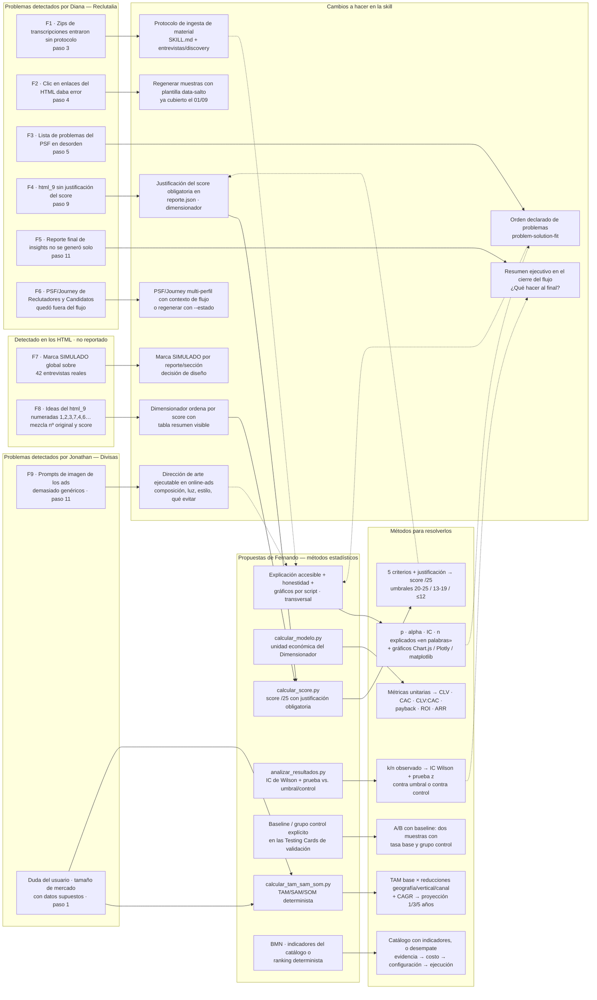

# Diagnóstico de fricciones y plan de mejora — flujo IRIS

Mapa de causa → cambio → método, a partir de la evaluación de los ejemplos reales
(`real_examples/`, 01/09/2026) y de las propuestas estadísticas de Fernando (pendiente 10 del
`to-do.md`).

## Diagrama

## Lectura

- **Lado izquierdo (colores de origen):** las 9 fricciones. Las 6 primeras vienen de las notas de
  Diana (Reclutalia), la 9 de las notas de Jonathan (Divisas), y las 7 y 8 se detectaron al leer
  los HTML (nadie las reportó). El bloque amarillo son las propuestas de Fernando (pendiente 10).
- **Centro:** los cambios de diseño que resuelven cada fricción (tabla del `to-do.md`).
- **Derecha:** los métodos concretos que implementan las propuestas de Fernando (script → fórmula
  → salida).
- Las flechas punteadas son refuerzos transversales (la explicación accesible aplica a cualquier
  número, el score alimenta la justificación del `html_9`, etc.).
