# Grafo del flujo IRIS (Mermaid)

> Vista visual del flujo. La **fuente de verdad ejecutable** es [`pasos.json`](pasos.json):
> los `nodo_mermaid` de cada paso apuntan a los `N*` de este diagrama.
> Si editas uno, edita el otro.

```mermaid
graph TD
    subgraph Inicio["Inicio | HTML_OUTPUT: html_1"]
        N28{"Cómo quieres iniciar?"}
    end
    subgraph 1__Investigacion["1. Investigacion | HTML_OUTPUT: html_1"]
        N1["Agente Benchmark"]
        N6["Agente Discussion Forums"]
        N13["Agente Foresight"]
        N23["Agente Search Trend Analysis"]
        N24["Agente Señales débiles"]
    end
    subgraph Decision___Entrevistas["Decision - Entrevistas | HTML_OUTPUT: html_2"]
        N9["Agente Entrevista de empatía"]
        N31{"Selección de agentes"}
        N34{"Simular o no"}
        N35{"¿Ejecución de entrevistas?"}
    end
    subgraph 2__Descubrimiento["2. Descubrimiento | HTML_OUTPUT: html_3"]
        N0["Agente A Day In The Life"]
        N5["Agente Discovery Survey"]
        N8["Agente Encuesta Kano"]
        N11["Agente Expo Quest"]
    end
    subgraph Persona_y_Problem_Solution_Fit["Persona y Problem-Solution Fit | HTML_OUTPUT: html_4 + html_5 + html_6"]
        N14["Agente HMW"]
        N16["Agente Journey Builder"]
        N19["Agente Persona Profile"]
        N21["Agente Problem Solution Fit"]
        N26{"Ambición estratégica"}
        N27{"Apalancamiento"}
        N29{"Elección de protopersona"}
        N36{"¿Hay datos reales de entrevistas / encuestas?"}
    end
    subgraph 3__Ideacion["3. Ideacion | HTML_OUTPUT: html_7 + html_8 + html_9 + html_10"]
        N2["Agente Business Model Navigator"]
        N3["Agente Caressing the client"]
        N4["Agente Dimensionador Estratégico de Ideas de Negocio"]
        N15["Agente Ideación"]
        N22["Agente Referral Builder"]
        N32{"Selección de agentes de ideación"}
        N33{"Selección de ideas"}
    end
    subgraph 4__Prototipado_y_Validacion["4. Prototipado y Validacion | HTML_OUTPUT: html_11"]
        N7["Agente Email Campaign"]
        N10["Agente Explainer Video"]
        N12["Agente Feature Stub"]
        N17["Agente Landing Page UX Analyzer"]
        N18["Agente Online Ads"]
        N20["Agente Pop-Up Store"]
        N25["Agente Simple Landing Page"]
        N30{"Selección de agente para validar"}
    end

    %% HTML 1: Inicio → Investigación
    N28 -->|"Estado actual"| N1
    N28 -->|"Futuros"| N13
    N28 -->|"Señales débiles de usuarios actuales"| N24
    N28 -->|"Opiniones y comentarios"| N6
    N6 --> N23

    %% HTML 2: Investigación → Entrevistas
    N1 --> N9
    N13 --> N9
    N24 --> N9
    N23 --> N9
    N9 --> N35
    N35 -->|"Sí — Respuestas e insights reales"| N31
    N35 -->|"No — Simulación de respuestas e insights"| N34
    N34 --> N31

    %% HTML 3: Selección → Descubrimiento
    N31 --> N0
    N31 --> N11
    N31 --> N8
    N31 --> N5

    %% HTML 4: Descubrimiento → Persona Profile → ¿Hay datos reales?
    N0 --> N19
    N11 --> N19
    N8 --> N19
    N5 --> N19
    N19 --> N36

    %% HTML 5: Problem Solution Fit → Elección de protopersona
    N36 -->|"Sí — Generación de profiles con data real"| N21
    N36 -->|"No — Generación de profiles a base de supuestos"| N21
    N21 --> N29
    N29 -->|"Por problema más grande"| N16
    N29 -->|"Por mayor tamaño en mercado"| N16

    %% HTML 6: Journey Builder
    N16 --> N14

    %% HTML 7: HMW → Ambición estratégica → Apalancamiento → Selección ideación
    N14 --> N26
    N26 -->|"Optimizar Negocio Actual"| N27
    N26 -->|"Crecer Negocio Actual"| N27
    N26 -->|"Expandir Negocio"| N27
    N26 -->|"Crear Nuevos Negocios"| N27
    N26 -->|"Reinventar el Futuro"| N27
    N27 -->|"Reducir Costos / Productividad"| N32
    N27 -->|"Nuevos clientes / Mayor frecuencia / Mayor ticket / Recuperación"| N32
    N27 -->|"Participación de mercado / Ampliar mercado / Nuevos casos de uso / Ecosistema"| N32
    N27 -->|"Nuevo producto / Nuevo modelo de negocio / Disrupción / Nuevas categorías / IA"| N32

    %% HTML 8: Selección ideación → Agentes ideación → Selección de ideas
    N32 --> N15
    N32 --> N3
    N32 --> N22
    N15 --> N33
    N3 --> N33
    N22 --> N33

    %% HTML 9: Dimensionador
    N33 --> N4

    %% HTML 10: Business Model Navigator
    N4 --> N2

    %% HTML 11: Business Model Navigator → Selección de agente → Prototipado
    N2 --> N30
    N30 --> N25
    N30 --> N17
    N30 --> N18
    N30 --> N7
    N30 --> N10
    N30 --> N20
    N30 --> N12
```

